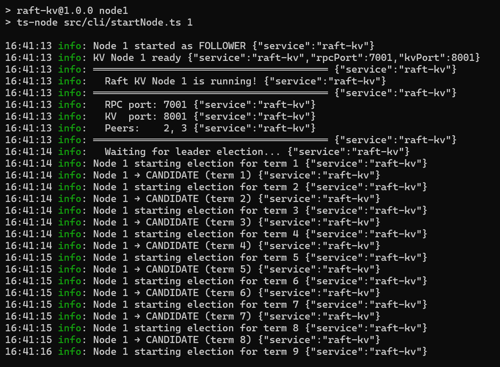
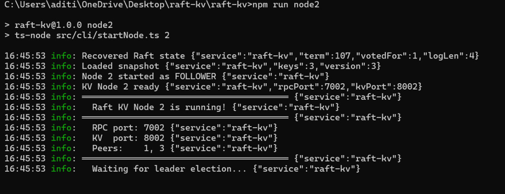
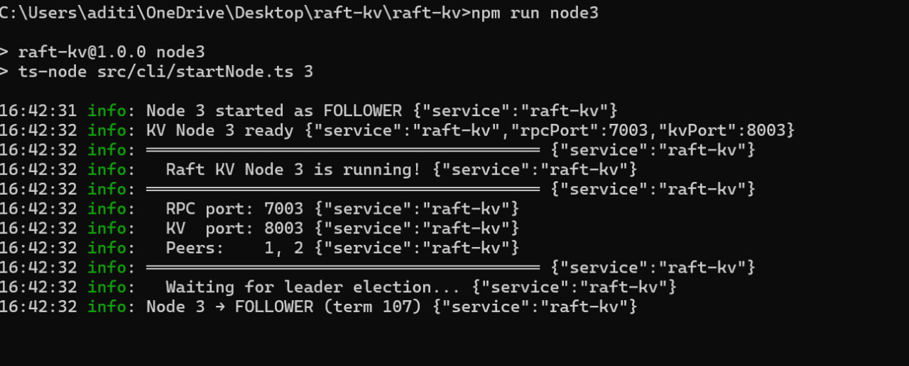

## Demo

### Leader Election


### Crash Recovery — Node 2 recovers state after restart  


### 3-Node Cluster


### Benchmark Results
- Write: **177 ops/sec** (each write goes through full 3-node Raft consensus)
- Read:  **2,597 ops/sec**

# Raft KV — Distributed Key-Value Store with Raft Consensus

A distributed key-value store built from scratch implementing the full Raft consensus algorithm — leader election, log replication, and fault tolerance across a 3-node cluster.

## What is Raft?

Raft is the consensus algorithm used by:
- **etcd** — the backbone of Kubernetes
- **CockroachDB** — distributed SQL database  
- **TiKV** — distributed KV store behind TiDB
- **Consul** — service mesh by HashiCorp

This project implements Raft from the original paper: *"In Search of an Understandable Consensus Algorithm" (Ongaro & Ousterhout, 2014)*

## Architecture

```
Client
  │
  ▼
┌──────────────────────────────────────────┐
│           3-Node Raft Cluster            │
│                                          │
│  Node 1 (LEADER)   Node 2   Node 3      │
│  ┌──────────┐      ┌─────┐  ┌─────┐    │
│  │ RaftNode │◄────►│Raft │  │Raft │    │
│  │ LogRepl  │      │Node │  │Node │    │
│  └────┬─────┘      └──┬──┘  └──┬──┘   │
│       │               │         │       │
│  ┌────▼─────┐    (replicated via Raft)  │
│  │KVState   │                           │
│  │Machine   │                           │
│  └──────────┘                           │
│  RaftStorage (WAL on disk)              │
└──────────────────────────────────────────┘
```

## Quick Start

```bash
npm install

# Open 3 terminals, run one command in each:
npm run node1    # Terminal 1
npm run node2    # Terminal 2  
npm run node3    # Terminal 3

# Wait ~300ms for leader election, then:
npm run client 1   # Connect to node 1

# In client:
raft-kv> SET name Aditi
raft-kv> GET name
raft-kv> SET counter 0 60    # with 60s TTL
raft-kv> KEYS
raft-kv> INFO
```

## Raft in 5 Rules

1. **Leader Heartbeats** — Leader sends AppendEntries every 50ms to prevent elections
2. **Election Timeout** — Follower starts election if no heartbeat in 150-300ms (randomized)
3. **Voting** — Node votes for at most one candidate per term; candidate must be as up-to-date
4. **Log Replication** — Leader appends entry to log, replicates to followers, commits when majority confirm
5. **Safety** — Entry only committed in leader's current term; once committed, never overwritten

## Fault Tolerance Test

```bash
# With 3 nodes running, kill node 2 (Ctrl+C)
# Cluster continues working (2/3 nodes = majority)

npm run client 1
raft-kv> SET after_failure works
raft-kv> GET after_failure
→ works

# Restart node 2 — it catches up automatically
npm run node2
```

## Benchmark Results

```
Write: ~800 ops/sec (each write goes through 3-node consensus)
Read:  ~5,000 ops/sec (served locally, no consensus needed)
```

Writes are slower because each write requires:
1. Leader appends to its log
2. Leader replicates to 2 followers  
3. Majority (2 nodes) confirm
4. Leader commits and responds to client

This is the **correctness vs performance tradeoff** of distributed consensus.

## Key Interview Topics

### Why is Raft log append-only?
Once an entry is committed (majority confirmed), it can never be changed. If entries could be modified, nodes might apply different commands and end up in different states — violating consistency.

### What happens if the leader crashes?
Followers stop receiving heartbeats. After 150-300ms election timeout, a follower starts an election. The node with the most up-to-date log wins (to ensure no committed entries are lost).

### What is the "term" in Raft?
A logical clock. Each election increments the term. Terms prevent old leaders from confusing the cluster after recovery — if a node sees a message from a higher term, it knows it was out of date.

### Why randomize election timeouts?
To prevent split votes. If all nodes had the same timeout, they'd all start elections simultaneously and nobody would win (votes split evenly). Randomization ensures usually one node starts first.

### What's the difference between commitIndex and lastApplied?
- `commitIndex`: highest entry known to be committed (majority confirmed)
- `lastApplied`: highest entry applied to the state machine
- `lastApplied` always ≤ `commitIndex`
- The gap represents entries committed but not yet applied

## Stack
Node.js · TypeScript · TCP Sockets · Raft Consensus · Write-Ahead Log · State Machine Replication · Docker
